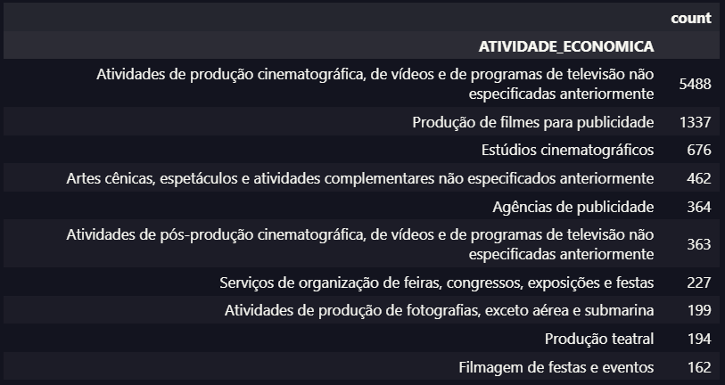
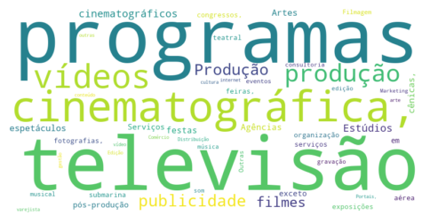
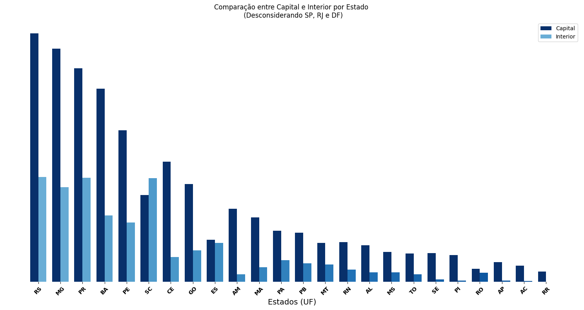
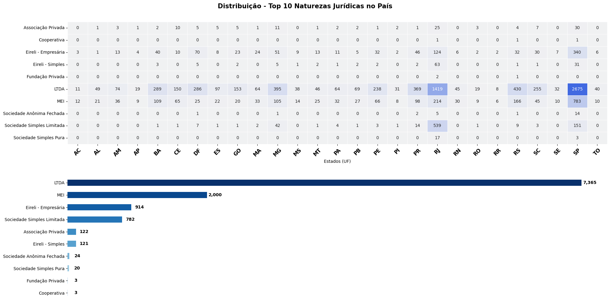
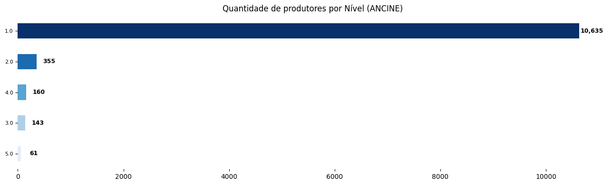
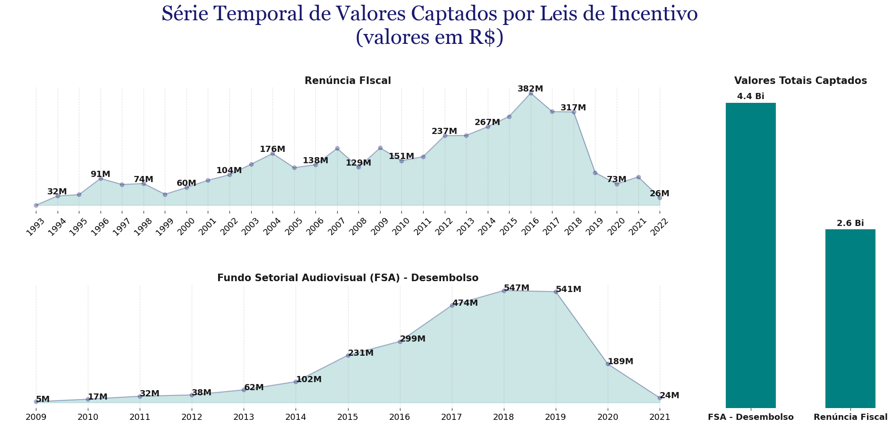

# Indústria Cinematográfica Brasileira

# ANCINE : Desafios e Oportunidades 

### **Contexto de Negócio**

A qualidade e a amplitude da indústria cinematográfica de um país são reflexos não apenas da sua cultura e sociedade, mas também das suas aspirações, desafios e conquistas. No Brasil, embora a indústria cinematográfica seja ativa e produza um número considerável de filmes anualmente em comparação com países de economias semelhantes, ela enfrenta uma batalha cultural com o cinema estrangeiro, principalmente o americano.

O consumo de entretenimento audiovisual no Brasil é largamente dominado pela indústria americana, em parte devido à sua habilidade de produzir filmes com grandes orçamentos e alto apelo comercial. Isso coloca as produções locais em uma competição desafiadora, muitas vezes com recursos financeiros e de marketing limitados em comparação com seus concorrentes estrangeiros.

Um dos principais fatores a considerar é a disparidade no acesso aos recursos dentro da indústria cinematográfica. Enquanto grandes estúdios e produções de alto orçamento geralmente conseguem financiamento e apoio comercial mais facilmente, cineastas independentes e produções de menor escala muitas vezes enfrentam dificuldades para garantir financiamento e distribuição adequada.

Além disso, as políticas públicas e os incentivos governamentais desempenham um papel crucial na sustentabilidade da indústria cinematográfica nacional. Investimentos em programas de financiamento, subsídios e incentivos fiscais podem ajudar a impulsionar a produção local e promover uma maior diversidade de vozes e perspectivas no cinema brasileiro.

___

### **Objetivo**  

O objetivo principal deste projeto é analisar dados da indústria cinematográfica brasileira para entender melhor os desafios enfrentados e identificar possíveis soluções para promover um ambiente mais sustentável e diversificado para a produção nacional de filmes.
---

Para ver código do projeto [clique aqui](https://github.com/fonsecadados/AgenciaNacionalDoCinema_ANCINE/blob/main/ANCINE_DesafiosEOportunidades.ipynb)
---

---
# Conhecendo os Dados

*Por conta do modelo de POO que foi aplicado nesse projeto, os dados foram previamente pré-processados, ou seja, não vamos encontrar tabelas com valores nulos ou colunas com tipos de dados equivocados. Para conhecer a documentação desse processo, clique [aqui](https://github.com/fonsecadados/AgenciaNacionalDoCinema_ANCINE/blob/main/processamento_dados.py).*

Com a fusão das tabelas "Agentes Econômicos Regulares", "Atividades Econômicas dos Agentes Regulares" e "Produtoras Independentes", temos acesso a uma quantidade considerável de dados, permitindo-nos uma compreensão mais profunda da estrutura dessa população. Esta tabela apresenta dados jurídicos dos agentes registrados na ANCINE, incluindo CNPJ, Natureza Jurídica e Atividade Econômica. 

Para dar início a análise foi feita uma junção entre 3 tabelas: Agentes Econômicos Regulares, Atividades Econômicas dos Agentes, e Produtoras Independentes. Essa junção foi feita para agilizar o processo e poluir menos a página do notebook. Para ver o código [clique aqui](https://github.com/fonsecadados/AgenciaNacionalDoCinema_ANCINE/blob/main/TabelaUnificadaANCINE.ipynb).  

Além da junção,  criada uma função para retornar um perfil básico do banco de dados escolhido. 

---

# "Produtora Independente"

A minuta da instrução normativa publicada pelo Ministério da Cultura estabelece critérios para classificação de empresa produtora independente para fins de captação de recursos por meio de fomento indireto, recurso de incentivo fiscal federal, relativo às atividades de financiamento de projetos audiovisuais. 

*Art. 2º. Somente as empresas classificadas na ANCINE como produtoras brasileiras independentes estarão aptas a captar recursos por meio de fomento indireto administrado pela ANCINE, de acordo com sua classificação de nível.*

Nesse projeto serão analisados apenas os dados dos Agentes que cumprem os requisitos da normativa e que possuem pontuação na classificação.

---

Essa segmentação da classificação do nível de produtora resultou em um corte 7.196 linhas de dados. Isso se justifica por que a tabela Agentes Econômicos Regulares abrange todos os registros na indústria audiovisual, que não se limita apenas ao processo direto de produção de obras cinematográficas, além do corte  dos agentes que não possuem classificação de nível de produtora, ou seja não é apto para captar recursos de incentivo.

#### Vamos analisar as Atividades Econômicas dos Agentes

Essa análise preliminar sobre as Atividades Econômicas dos Agentes nos retornou 186 tipos diferentes de atividades:

A lista de palavras mostra uma enorme quantidade outliers que vão poluir futuramente a visualização das nuvens, como preposições, conjunções e palavras recorrentes nos títulos das atividades e que não fazem parte do contexto.

Nuvem de Palavras com as 50 mais recorrentes:    
   

Nuvem de Palavras com 400 menos recorrentes:

A nuvem de palavras nos mostra a diversidade de atividades econômicas dentre os agentes com classificação de nível de produtora. Vamos analisar a distribuição geográfica desses agentes

---
### **Qual a distribuição geográfica dos agentes econômicos no Brasil?**

Observa-se uma concentração considerável de agentes econômicos nos estados de São Paulo (SP) e Rio de Janeiro (RJ) no setor audiovisual. Tal concentração é influenciada pela centralização das atividades de mercado e da disponibilidade de mão de obra qualificada nesses dois estados.

Além da concentração de agentes dos estados de SP e RJ, vemos também uma concentração evidente nas regiões Sul e Sudeste. Vejamos esse mapa de distribuição:

---

Para melhor compreender a distribuição dos agentes econômicos, é necessário considerar a exclusão de SP e RJ da análise. Ao realizar essa exclusão, evidenciam-se padrões diferentes de distribuição, refletindo uma dispersão mais equitativa da atividade econômica pelo território nacional. Essa alteração na distribuição reflete as dinâmicas regionais específicas do setor audiovisual fora dos polos tradicionais, revelando potenciais áreas de crescimento e desenvolvimento em outras regiões do país, como os estados da Bahia e Pernambuco, além do Distrito Federal.

Gráfico de comparação entre o número de produtoras na capital vs a somatória de produtoras fora da capital (Excluindo SP, RJ e o Distrito Federal)

Esse próximo painel constatamos 3 informações distintas e incomuns: Curiosamente, enquanto Santa Catarina é o único estado da federação onde o número de produtores em municípios não capitalinos supera o número na capital Florianópolis, Espírito Santo é o estado com a divisão mais equalizada: 49.6% em Vitória e 50.4% fora da capital. Além disso, no estado de Roraima 100% dos produtores estão na capital Boa Vista.

Estudando mais o tema, vamos analisar o ranking de natureza juridica dos agentes econômicos

Apesar da natureza jurídica LTDA (Sociedade Empresária Limitada) controlar majoritariamente a arrecadação no mercado, o MEI (Micro Empreendedor Individual) desempenha um papel significativo na indústria audiovisual brasileira, principalmente em um contexto de transformação digital e na democratização da produção de conteúdo. Através do MEI produtores independentes tem acesso a uma estrutura jurídica simplificada e custos operacionais mais baixos em relação à outras naturezas jurídicas, possibilitando que futuros profissionais da inústria começem seus próprios negócios com mais facilidade. 

<!--
Vejamos as classificações de nível de produtora:

-->

#### **Desafios Identificados**  

Disparidade no Acesso a Recursos: Acesso desigual aos recursos dentro da indústria cinematográfica, com grandes estúdios e produções de alto orçamento tendo vantagens significativas em relação a cineastas independentes.

Domínio do Cinema Estrangeiro: Predomínio do cinema estrangeiro, principalmente o americano, no mercado brasileiro, o que cria uma competição desigual para as produções locais.

---
#### **Séries Temporais**

Análise da valores captados  através de Renúncia FIscal e Desembolso durante o todo o período de coleta dos dados.

#### **Estatística Descritiva**

#### Sumário de métricas estatísticas

##### Renúncia Fiscal

##### FSA / Desembolso

#### Atributos Categóricos

#### **Possíveis Soluções**  

**Incentivos Governamentais:** Implementação de políticas públicas e incentivos governamentais para promover a produção local, como subsídios, incentivos fiscais e programas de financiamento específicos para cineastas independentes.

**Promoção da Diversidade:** Apoio e promoção de uma maior diversidade de vozes e perspectivas na indústria cinematográfica brasileira, através de programas de apoio a produções de menor escala e de nicho.

---

#### **Conclusão**  

Este projeto de ciência de dados visa fornecer insights valiosos sobre os desafios enfrentados pela indústria cinematográfica brasileira e propor possíveis soluções para promover um ambiente mais sustentável e diversificado para a produção nacional de filmes. Ao compreender melhor o contexto sócio-econômico da indústria, esperamos contribuir para o fortalecimento e crescimento do cinema brasileiro.

