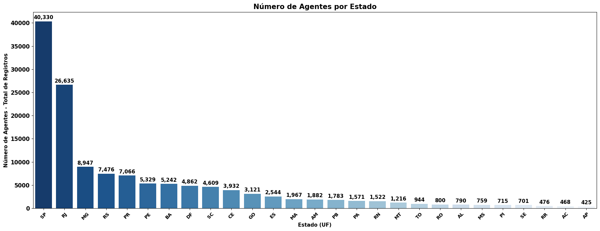
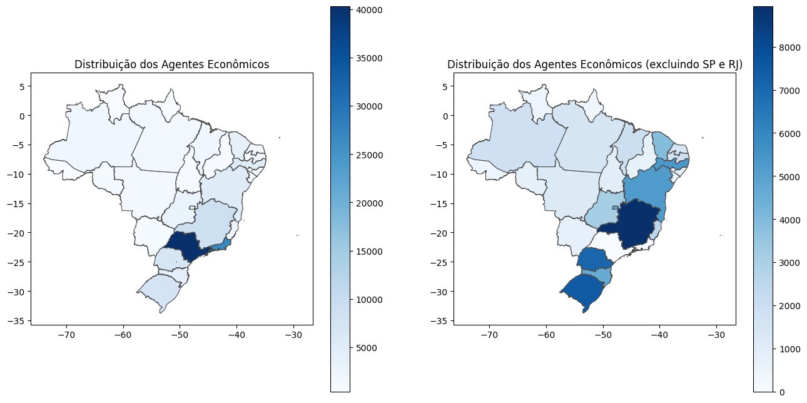
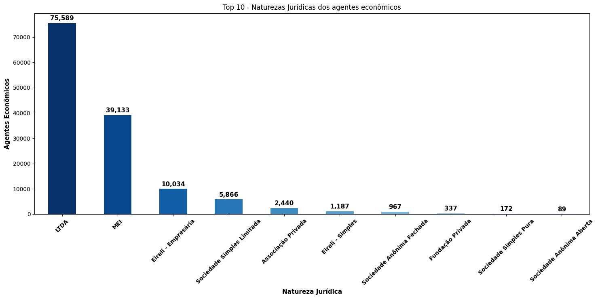

# AgenciaNacionalDoCinema_ANCINE

#### Desafios e Oportunidades na Indústria Cinematográfica Brasileira: Uma Análise de Ciência de Dados

#### **Contexto de Negócio**

A qualidade e a amplitude da indústria cinematográfica de um país são reflexos não apenas da sua cultura e sociedade, mas também das suas aspirações, desafios e conquistas. No Brasil, embora a indústria cinematográfica seja ativa e produza um número considerável de filmes anualmente em comparação com países de economias semelhantes, ela enfrenta uma batalha cultural com o cinema estrangeiro, principalmente o americano.

O consumo de entretenimento audiovisual no Brasil é largamente dominado pela indústria americana, em parte devido à sua habilidade de produzir filmes com grandes orçamentos e alto apelo comercial. Isso coloca as produções locais em uma competição desafiadora, muitas vezes com recursos financeiros e de marketing limitados em comparação com seus concorrentes estrangeiros.

Um dos principais fatores a considerar é a disparidade no acesso aos recursos dentro da indústria cinematográfica. Enquanto grandes estúdios e produções de alto orçamento geralmente conseguem financiamento e apoio comercial mais facilmente, cineastas independentes e produções de menor escala muitas vezes enfrentam dificuldades para garantir financiamento e distribuição adequada.

Além disso, as políticas públicas e os incentivos governamentais desempenham um papel crucial na sustentabilidade da indústria cinematográfica nacional. Investimentos em programas de financiamento, subsídios e incentivos fiscais podem ajudar a impulsionar a produção local e promover uma maior diversidade de vozes e perspectivas no cinema brasileiro.

___

#### **Objetivo**  

O objetivo principal deste projeto é analisar dados da indústria cinematográfica brasileira para entender melhor os desafios enfrentados e identificar possíveis soluções para promover um ambiente mais sustentável e diversificado para a produção nacional de filmes.

---
#### **Metodologia**  

Utilizaremos uma abordagem de ciência de dados, com análise exploratória dos dados fornecidos pela ANCINE, incluindo registros de agentes econômicos, atividades na indústria, financiamento de projetos, perfil de investidores e realizadores, entre outros. Faremos uso de técnicas estatísticas e de visualização de dados para identificar padrões e tendências relevantes.

---

Natureza Jurídica dos Agentes Econômicos

Observa-se uma concentração considerável de agentes econômicos nos estados de São Paulo (SP) e Rio de Janeiro (RJ) no setor audiovisual. Tal concentração é influenciada pela centralização das atividades de mercado e da disponibilidade de mão de obra qualificada nesses dois estados.

Observa-se uma concentração considerável de agentes econômicos nos estados de São Paulo (SP) e Rio de Janeiro (RJ) no setor audiovisual. Tal concentração é influenciada pela centralização das atividades de mercado e da disponibilidade de mão de obra qualificada nesses dois estados.

Para melhor compreender a distribuição dos agentes econômicos, é necessário considerar a exclusão de SP e RJ da análise. Ao realizar essa exclusão, evidenciam-se padrões diferentes de distribuição, refletindo uma dispersão mais equitativa da atividade econômica pelo território nacional. Essa alteração na distribuição reflete as dinâmicas regionais específicas do setor audiovisual fora dos polos tradicionais, revelando potenciais áreas de crescimento e desenvolvimento em outras regiões do país.

Estuando mais o tema, vamos analisar o ranking de natureza juridica dos agentes econômicos

#### **Desafios Identificados**  

Disparidade no Acesso a Recursos: Acesso desigual aos recursos dentro da indústria cinematográfica, com grandes estúdios e produções de alto orçamento tendo vantagens significativas em relação a cineastas independentes.

Domínio do Cinema Estrangeiro: Predomínio do cinema estrangeiro, principalmente o americano, no mercado brasileiro, o que cria uma competição desigual para as produções locais.

---

#### **Possíveis Soluções**  

**Incentivos Governamentais:** Implementação de políticas públicas e incentivos governamentais para promover a produção local, como subsídios, incentivos fiscais e programas de financiamento específicos para cineastas independentes.

**Promoção da Diversidade:** Apoio e promoção de uma maior diversidade de vozes e perspectivas na indústria cinematográfica brasileira, através de programas de apoio a produções de menor escala e de nicho.

---

#### **Conclusão**  

Este projeto de ciência de dados visa fornecer insights valiosos sobre os desafios enfrentados pela indústria cinematográfica brasileira e propor possíveis soluções para promover um ambiente mais sustentável e diversificado para a produção nacional de filmes. Ao compreender melhor o contexto sócio-econômico da indústria, esperamos contribuir para o fortalecimento e crescimento do cinema brasileiro.

